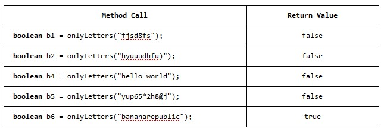

###### CS-207-3: Programming II   Spring 2021   Northeastern Illinois University   Workshop Week 6   Exam 1 Review

**Getting Started**

**1.** Detailed instructions are located in the tutorial videos. 
**2.** Accept the assignment invitation on D2L. 
**3.** Clone the assignment to your computer. 
**4.** Go to File > Project Structure. Under Project Settings, click on Project and verify that the Project SDK is set
to JDK 11 or higher.  If it is not, select the correct SDK from the drop-down. 
**5.** Go to File > Settings (Mac: IntelliJ IDEA > Preferences). Under Build, Execution, Deployment and under Build
Tools, click Gradle. Make sure Build and run using: and Run tests using: are set to Gradle. Make sure Use Gradle from:
is set to 'gradle-wrapper.properties' file. And make sure Gradle JVM is set to JDK 11 or higher. 
**6.** Project SDK and Gradle JVM should be set to the same Java version. 
**7.** Create the `main/java` directory in the `src` directory. This is where you will be creating your Java classes for
your assignment. Right click `src` and go to New > Directory and select `main/java`. 

### Problem 1

**1.** In the main/java directory, create a class named `MyFile` that has the following:
- One properly encapsulated instance variable: A `String` named `name`.
- A default no-argument constructor that sets the `name` instance variable to "file.txt".
- A second constructor that takes one parameter (a `String`) and sets the `name` instance variable.
- A getter for the `name` instance variable.
    - Uncomment the test named `shouldInitializeNameWithConstructors` in the `MyFileTest` class 
      (in the test/java directory). Run the code analyzers and commit your code now.
- A method named `totalBytes` that takes a `String` array parameter named `lengths` and returns an integer.
  Each `String` in the `lengths` array is a valid `String` representation of an integer and represents the number
  of bytes for a particular line in the file. The method should sum up all the values and return the sum,
  which is the total number of bytes in the file.
    - Uncomment the test named `totalBytes_shouldSumNumbersInStringArray` in the `MyFileTest` class
      (in the test/java directory). Run the code analyzers and commit your code now.
      
**2.** In the main/java directory, create a class named `MyFileDemo`.
- To test your class, make several `MyFile` objects and call the method for each object.

### Problem 2

**1.** In the `MyFile` class create static method named `onlyLetters` that takes a `String` as a
parameter and returns  a `boolean`.
The method should return `true` if the parameter contains only lowercase and uppercase letters and
no other characters, and `false` otherwise. Sample method usage has been provided for you below.
Solve this in three different ways:
- Using a loop.
    - Uncomment the test named `onlyLetters_shouldReturnTrueForStringsContainingOnlyLetters` in the `MyFileTest` class
      (in the test/java directory). Run the code analyzers and commit your code now.
- No loop.
    - Comment out the code using a loop and run the test named `onlyLetters_shouldReturnTrueForStringsContainingOnlyLetters` in the `MyFileTest` class
      (in the test/java directory). Run the code analyzers and commit your code now.
- Using only StringBuilder methods and wrapper classes. You may not use the `||` or `&&` logical operators as part of this solution.
    - Comment out the code using no loop and run the test named `onlyLetters_shouldReturnTrueForStringsContainingOnlyLetters` in the `MyFileTest` class
      (in the test/java directory). Run the code analyzers and commit your code now.

